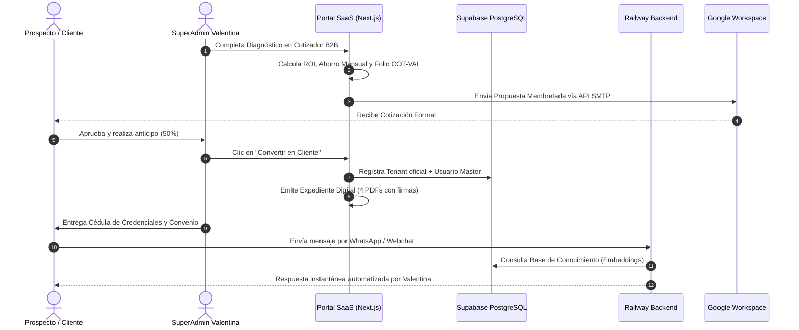

# 🗺️ MAPA DE ARQUITECTURA DEL PROYECTO: VALENTINA AI
> **Documento de Topología Técnica, Componentes, Flujo de Datos e Infraestructura.**  
> *Versión:* 2.0 (Full Monorepo) | *Actualización:* 2026-09-10  
> *Repositorio:* `claudiopulido-wq/valentina-ai`

---

## 1. 🌐 Visión General de la Arquitectura (High-Level Topology)

El proyecto está diseñado bajo un modelo monorepo modular desacoplado en tres capas principales:

```
                                  [ INTERNET / CLIENTES ]
                                             │
                      ┌──────────────────────┼──────────────────────┐
                      ▼                      ▼                      ▼
               valentina-ai.mx       portal.valentina-ai.mx     localhost:3001
             ┌─────────────────┐   ┌──────────────────────┐   ┌──────────────────┐
             │   1. LANDING    │   │  2. SAAS PLATFORM    │   │ 3. MEDIA STUDIO  │
             │   CORPORATIVA   │   │     & SUPERADMIN     │   │ (Open Higgsfield)│
             └────────┬────────┘   └──────────┬───────────┘   └────────┬─────────┘
                      │                       │                        │
                      │                       ▼                        ▼
                      │             ┌────────────────────┐   ┌──────────────────┐
                      │             │ Next.js API Routes │   │ Muapi.ai Engine  │
                      │             └────────┬───────────┘   └──────────────────┘
                      │                      │
                      ▼                      ▼
         ┌────────────────────────────────────────────────────────┐
         │              INFRAESTRUCTURA CLOUD CONECTADA           │
         ├────────────────────────┬───────────────────────────────┤
         │ • Supabase (Auth + DB) │ • Railway (WhatsApp Backend)  │
         │ • Vercel (Hosting Web) │ • Google Workspace (SMTP B2B) │
         └────────────────────────┴───────────────────────────────┘
```

---

## 2. 📂 Desglose Estructural por Aplicaciones

### 🏛️ MÓDULO 1: Landing Page Corporativa (`/`)
* **Propósito:** Presentación de marca, catálogo de soluciones, vitrina de casos de éxito y captura de prospectos B2B.
* **Stack:** HTML5 Semántico, Vanilla CSS (estética Dark Glassmorphism de alta gama), Vanilla JavaScript modular.
* **Archivos Clave:**
  * `index.html`: Estructura principal, optimizada para SEO (OpenGraph, JSON-LD Schema.org, metatags ejecutivos).
  * `css/style.css`: Sistema de diseño, gradientes, animaciones y tokens visuales.
  * `js/main.js`: Lógica de interactividad, reproductores de video cinemático y formulario de contacto.
  * `assets/`: 
    * Videos cinemáticos generados con IA (Wan 2.1, MiniMax Hailuo 02).
    * `politicas-y-precios/`: Documentos legales base, plantilla de hoja membretada institucional y política comercial oficial (`POL-COM-VAL-2026-B`).

---

### 💻 MÓDULO 2: Plataforma SaaS & SuperAdmin (`platform/`)
* **Propósito:** Núcleo operativo del software: autenticación multi-tenant, bandeja de entrada omnicanal en tiempo real, gestión de bases de conocimiento (RAG), panel SuperAdmin, wizard de onboarding con expedientes legales y cotizador B2B reactivo.
* **Stack:** Next.js 16.3 (Turbopack, App Router), React 19, TypeScript, Tailwind CSS v4, Lucide Icons, Supabase JS.
* **Hosting:** Vercel (`prj_7kCmebng7N1otPjda6agWIPDqQgb` ➔ `portal.valentina-ai.mx`).

#### Árbol de Componentes y Lógica (`platform/src/`):
```tree
platform/src/
├── app/
│   ├── layout.tsx                     # Layout global con Google Font Inter
│   ├── page.tsx                       # Orquestador de vistas según rol (SuperAdmin vs Portal Cliente)
│   ├── globals.css                    # Tokens de diseño Google Workspace Clean Light
│   └── api/                           # Endpoints Backend Server-Side
│       ├── sales/send-quote/route.ts  # Despacho de cotizaciones vía Google Workspace SMTP
│       └── tenants/[tenantId]/
│           └── knowledge/             # CRUD de Base de Conocimiento RAG y reindexación
├── components/
│   ├── SuperAdminView.tsx             # Panel de Control Maestro (Orquestador ligero)
│   ├── LiveOmnichannelInbox.tsx       # Bandeja de entrada omnicanal (WhatsApp/Web)
│   ├── KnowledgeBaseManager.tsx       # Gestor de documentos RAG para IA (Orquestador)
│   ├── GoogleSidebar.tsx              # Navegación lateral estilo Google Workspace
│   ├── AppleMetricsWidgets.tsx        # Widgets de telemetría y métricas operativas
│   ├── AuthModal.tsx                  # Modal de autenticación y cambio de inquilino
│   │
│   ├── superadmin/                    # SUBCOMPONENTES DE CONTROL SUPERADMIN
│   │   ├── TenantsDirectoryTab.tsx    # Tab 1: Directorio de Empresas clientes
│   │   ├── CredentialsDirectoryTab.tsx# Tab 2: Control de Credenciales y RBAC
│   │   ├── CloudInfrastructureTab.tsx # Tab 3: Costos Cloud reales y tabla P&L
│   │   ├── SalesPipelineTab.tsx       # Tab 4: Pipeline B2B y conversión a cliente
│   │   └── SupabaseSqlModal.tsx       # Modal con Blueprint SQL RLS multi-tenant
│   │
│   ├── onboarding/                    # ALTA DIGITAL DE CLIENTES
│   │   ├── ClientOnboardingWizard.tsx # Orquestador en 4 pasos
│   │   ├── Step1CorporateIdentity.tsx # Paso 1: Razón Social, RFC y datos fiscales
│   │   ├── Step2ChannelsArchitecture.tsx # Paso 2: WhatsApp Cloud API, CRM y Agenda
│   │   ├── Step3PricingMeta.tsx       # Paso 3: Selección de Planes y Calculadora Meta
│   │   └── Step4Credentials.tsx       # Paso 4: Credenciales del Director y emisión
│   │
│   ├── knowledge/                     # BASE DE CONOCIMIENTOS RAG
│   │   ├── KnowledgeDocumentCard.tsx  # Tarjeta de fragmento semántico y estado vector
│   │   ├── KnowledgeFormModal.tsx     # Modal de alta y edición con Voyage AI
│   │   └── KnowledgeDeleteModal.tsx   # Confirmación de baja o desactivación de vector
│   │
│   ├── dossier/                       # GENERADOR DE EXPEDIENTE DIGITAL B2B
│   │   ├── ClientDossierModal.tsx     # Visor multi-pestaña con exportación window.print()
│   │   ├── ExecutiveQuoteSheet.tsx    # Hoja 1: Cotización Formal Membretada
│   │   ├── ExecutiveAgreementSheet.tsx# Hoja 2: Convenio Comercial (2 págs, 8 cláusulas, firmas)
│   │   ├── ExecutiveRaciSheet.tsx     # Hoja 3: Matriz RACI & Checklist de Prerrequisitos
│   │   └── ExecutiveCredentialSheet.tsx # Hoja 4: Cédula de Credenciales y QR de Acceso
│   │
│   └── sales/                         # COTIZADOR Y PIPELINE B2B
│       ├── SalesQuoteGeneratorModal.tsx # Diagnóstico nómina humana, ROI, checklist y folios
│       └── CommercialQuotePdfSheet.tsx  # Render de hoja membretada COT-VAL-2026-XXXX

│
├── lib/                               # SERVICIOS Y CONECTORES
│   ├── supabaseClient.ts              # Cliente Supabase Browser (Frontend)
│   ├── serverAuth.ts                  # Autenticación y verificación de tokens en servidor
│   ├── permissions.ts                 # Control de acceso basado en roles (RBAC)
│   ├── knowledgeService.ts            # Consumo de API RAG en Railway
│   ├── ugesSupabase.ts                # Conexión espejo de solo lectura con bot UGES
│   └── ugesDataService.ts             # Adaptador de métricas institucionales UGES
│
├── data/
│   └── mockData.ts                    # Inquilinos demo enriquecidos y cotizaciones seed
└── types/
    └── platform.ts                    # Definiciones TypeScript de Tenant, Quotes, Roles
```

---

### 🎨 MÓDULO 3: Media Studio & Open Higgsfield AI (`studio/`)
* **Propósito:** Generador multimedia de IA para crear contenido visual de marketing, videos cinemáticos de casos de estudio y avatares para clientes.
* **Stack:** Next.js / Vite, ReactFlow / XyFlow, Tailwind CSS, Electron-ready, Babel.
* **Motor Generativo:** API de **Muapi.ai** (`https://api.muapi.ai`) con saldo activo ($10 USD).
* **Archivos Clave:**
  * `src/lib/muapi.js`: Cliente de comunicación con Muapi (autenticación vía `x-api-key`, ciclo submit ➔ polling).
  * `src/lib/models.js`: Registro de modelos soportados (Nano Banana Pro, Flux Schnell, Wan 2.1, Hailuo, MiniMax).
  * `packages/studio/`: Paquete central de interfaz de generación visual.
  * `packages/Vibe-Workflow/`: Constructor de flujos y pipelines nodo a nodo.
  * `project_knowledge.md`: Especificación técnica del motor de generación.

---

## 3. 🔄 Flujo de Datos End-to-End (Data Flow Pipeline)



---

## 4. 🔐 Matriz de Seguridad y Permisos (RBAC)

El SaaS implementa tres niveles jerárquicos de acceso:

| Rol | Alcance | Pantallas Accesibles | Permisos Especiales |
| :--- | :--- | :--- | :--- |
| **`superadmin`** | Plataforma Global | • Directorio de Empresas<br>• Control de Credenciales<br>• Métricas Cloud & P&L<br>• Cotizador & Pipeline B2B | Crear clientes, emitir convenios legales, cotizar, ver costos globales y resetear accesos. |
| **`tenant_admin`** | Empresa Específica | • Métricas del Inquilino<br>• Bandeja Omnicanal en Vivo<br>• Gestor de Conocimiento (RAG)<br>• Gestión de Agentes | Cargar manuales/catálogos, pausar chatbot para tomar control humano del chat. |
| **`agent` / `viewer`** | Operativo | • Bandeja de Chat en tiempo real | Responder conversaciones asignadas sin acceso a configuración ni finanzas. |

---

## 5. ⚙️ Variables de Entorno y Configuración de Infraestructura

* **Ubicación:** [`platform/.env.local`](file:///c:/Users/ASUS/Desktop/Antigravity/Proyecto%20Valentina/platform/.env.local)

```ini
# Supabase Valentina (Auth, Tenants, RLS)
NEXT_PUBLIC_SUPABASE_URL=https://xrheyqhigeutkzqigvmg.supabase.co
NEXT_PUBLIC_SUPABASE_ANON_KEY=eyJhbGci...

# Conexión Espejo Bot WhatsApp UGES (Read-Only)
NEXT_PUBLIC_UGES_BOT_SUPABASE_URL=https://jzlqwkfclrejblwayqef.supabase.co
NEXT_PUBLIC_UGES_BOT_SUPABASE_ANON_KEY=sb_publishable_...

# Backend WhatsApp / RAG en Railway
PLATFORM_API_KEY=fadb1c4788...
PLATFORM_API_BASE_URL=https://whatsapp-empresarial-production.up.railway.app
```

---

## 6. 🚀 Hoja de Ruta de Escalabilidad (Próximos Hitos)

1. **Persistencia SQL de Cotizaciones:** Mapeo de `CommercialQuote` a la tabla `public.commercial_quotes` con RLS en Supabase.
2. **Webhooks de Facturación:** Activación automática al conciliar el 50% de anticipo bancario.
3. **Generador Serverless de PDF:** Integración de `@react-pdf/renderer` para adjuntar documentos binarios reales sin depender del diálogo de impresión del navegador.
